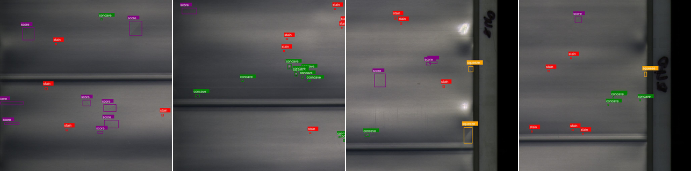
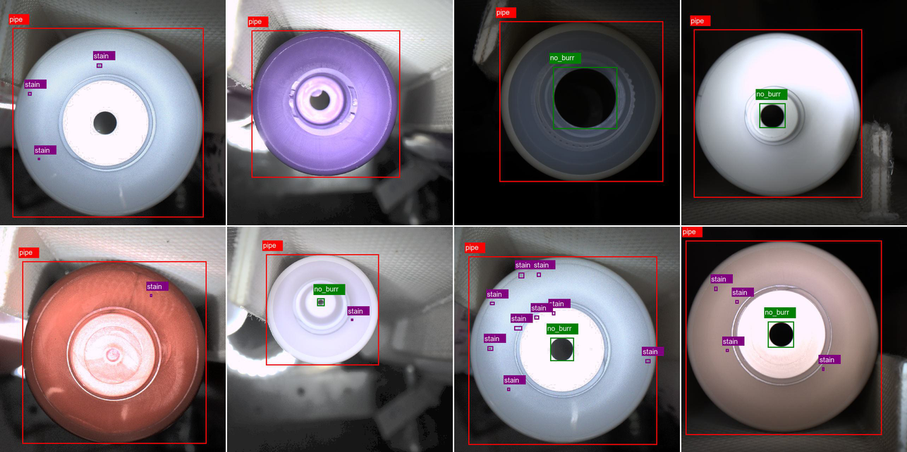
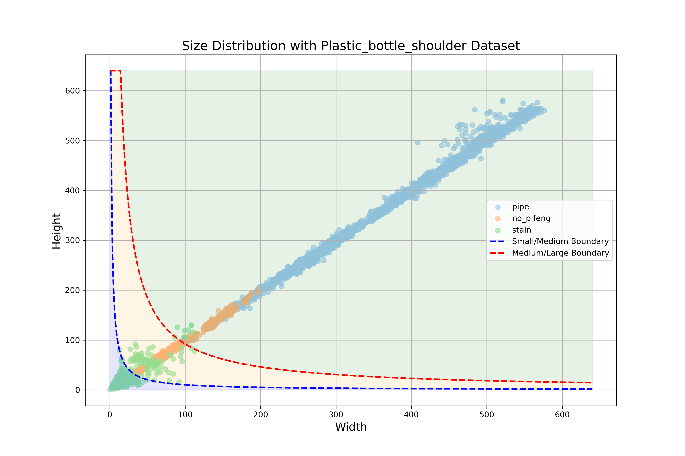

# PBD: Plastic Bottle Dataset for Defect Detection

Zhenyuan Lin, Danhua Liu*, Lai Wei, Yubo Dong



Figure 1: some sample images from the Plastic
Bottle Body dataset along with their corresponding annotations. It includes examples of various defect types such as
stain, cavevex, score, and squeeze.



Figure 2: some sample images images from the Plastic Bottle
Shoulder dataset along with their corresponding annotations.
It includes examples of defects such as stain and no-pifeng(burr), as well
as the pipe positioning annotation.


Figure 3: Distribution of defect annotation features for the Plastic Bottle Body dataset


Figure 4: Distribution of defect annotation features for the Plastic Bottle Shoulder dataset


## Code Configuration
This repository is modified from MMDetection. The original MMDetection repository can be found at [https://github.com/open-mmlab/mmdetection](https://github.com/open-mmlab/mmdetection).

### 1. Installation

- Anaconda
```bash
conda create -n PBD python=3.8
```
- Pytorch
```bash
conda install pytorch==2.0.0 torchvision==0.15.0 torchaudio==2.0.0 pytorch-cuda=11.7 -c pytorch -c nvidia
# or
pip install torch==2.0.0 torchvision==0.15.1 torchaudio==2.0.1
```
- Other Extra Dependencies
```bash
# for mmcv, you can see in https://mmcv.readthedocs.io/zh-cn/latest get_started/installation.html 
pip install mmcv==2.0.0 -f https://download.openmmlab.com/mmcv/dist/cu117/torch2.0/index.html 

# for mmdetection
pip install -r requirements.txt
pip install -v -e .  # or "python setup.py develop"
```
### 2. Prepare Dataset
The PBD Dataset can be downloaded from the Baidu Cloud link,Google Drive Link and Quark Cloud Link:

Baidu Cloud Link : https://pan.baidu.com/s/1MdaGlw1uC1xE0s7FRQ3zTw
Extraction code: 6666.

Google Drive Link : https://drive.google.com/file/d/1sJWv5F3UEuZinFIr9QyG9UT-W0QdOuAy/view?usp=drive_link


Quark Cloud Link : https://pan.quark.cn/s/db48ef83eb86

After downloading and extracting the dataset, place it in the PBD/dataset folder.


### 3. How to RUN?
To start training with PBD:
```bash
# In PBD folder
python tools/train.py {config_file}
# Example:
# python configs/atss/atss_r50_fpn_1x_coco.py
```
### 4. Acknowledgment
This work is forked from MMdetection Repository https://github.com/open-mmlab/mmdetection