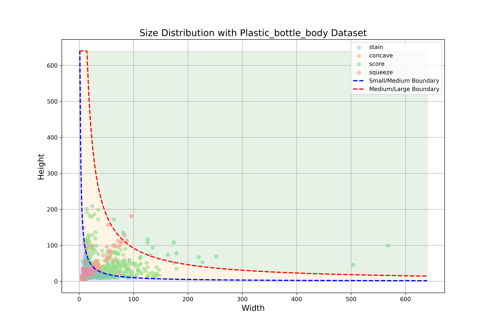
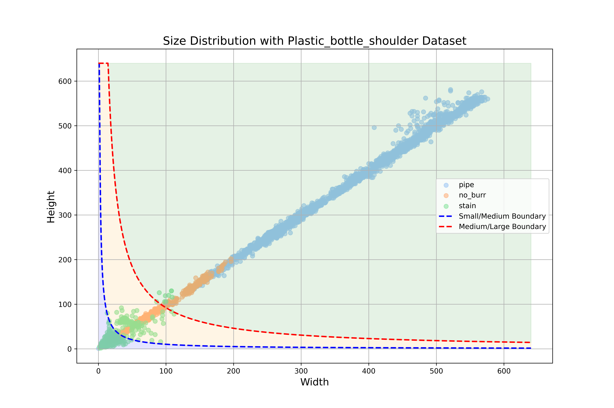

# PBD: Plastic Bottle Dataset for Defect Detection

Zhenyuan Lin, Danhua Liu*, Lai Wei, Yubo Dong

## PBD
- Plastic Bottle Body : 500 images with four common defect types (stain, concave, score and squeeze).
- Plastic Bottle Shoulder : 3,463 images with two common defect types (stain and no_burr) and one bottle neck positioning marker (pipe).


Figure 1: Some sample images from the Plastic
Bottle Body dataset along with their corresponding annotations



Figure 2: Distribution of defect annotation features for the Plastic Bottle Body dataset


Figure 3: Some sample images images from the Plastic Bottle
Shoulder dataset along with their corresponding annotations


Figure 4: Distribution of defect annotation features for the Plastic Bottle Shoulder dataset

## Usage
This dataset is allowed for **academic purposes only**.

## Code Configuration
This repository is modified from MMDetection. The original MMDetection repository can be found at [https://github.com/open-mmlab/mmdetection](https://github.com/open-mmlab/mmdetection).

### 1. Installation

- Anaconda
```bash
conda create -n PBD python=3.8
```
- Pytorch
```bash
# conda
conda install pytorch==2.0.0 torchvision==0.15.0 torchaudio==2.0.0 pytorch-cuda=11.7 -c pytorch -c nvidia
# or pip
pip install torch==2.0.0 torchvision==0.15.1 torchaudio==2.0.1
```
- Other Extra Dependencies
```bash
# for mmcv, you can see in https://mmcv.readthedocs.io/zh-cn/latest get_started/installation.html 
pip install mmcv==2.0.0 -f https://download.openmmlab.com/mmcv/dist/cu117/torch2.0/index.html 

# for mmdetection
pip install -r requirements.txt
pip install -v -e .  # or "python setup.py develop"
```
### 2. Prepare Dataset
The PBD Dataset can be downloaded from the [Baidu Cloud](https://pan.baidu.com/s/1-xLSYv7BEUVjskto7yn0Dg?pwd=6666) | [Google Drive](https://drive.google.com/file/d/1tJjobvwOaQk8iHmFNYSYLYyO0G9is6ht/view?usp=sharing) | [Quark Cloud](https://pan.quark.cn/s/9d717abaf299)


After downloading and extracting the dataset, place it in the PBD/dataset folder.


### 3. How to RUN?
To start training with PBD:
```bash
# In PBD folder
python tools/train.py {config_file}
# Example:
# python configs/atss/atss_r50_fpn_1x_coco.py
```
### 4. Acknowledgment
This work is forked from MMdetection Repository https://github.com/open-mmlab/mmdetection.

## Citation

```
@inproceedings{PBD,
  author    = {Zhenyuan Lin,Danhua Liu,Lai Wei, Yubo Dong}
  title     = {PBD: Plastic Bottle Dataset for Defect Detection}
  booktitle = {ICASSP}
  year      = {2025}
}
```